# UML LAB3 Quản lý khách sạn

Các khối Mermaid hiển thị ngay trên GitHub; để sửa bằng draw.io chọn Arrange → Insert → Advanced → Mermaid rồi dán nội dung từng khối. Quan hệ dùng khóa trong `Database/01_schema.sql`.

## Use Case tổng quát và phân rã

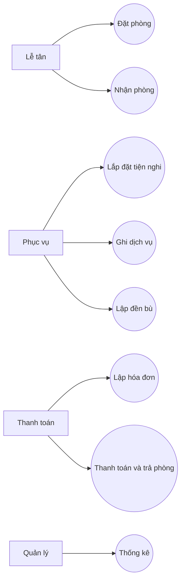

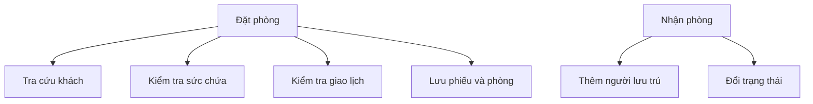

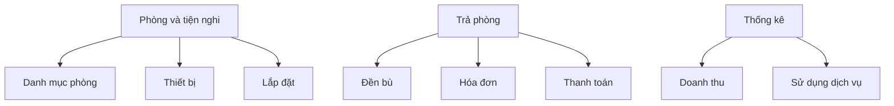

## Biểu đồ lớp phân tích

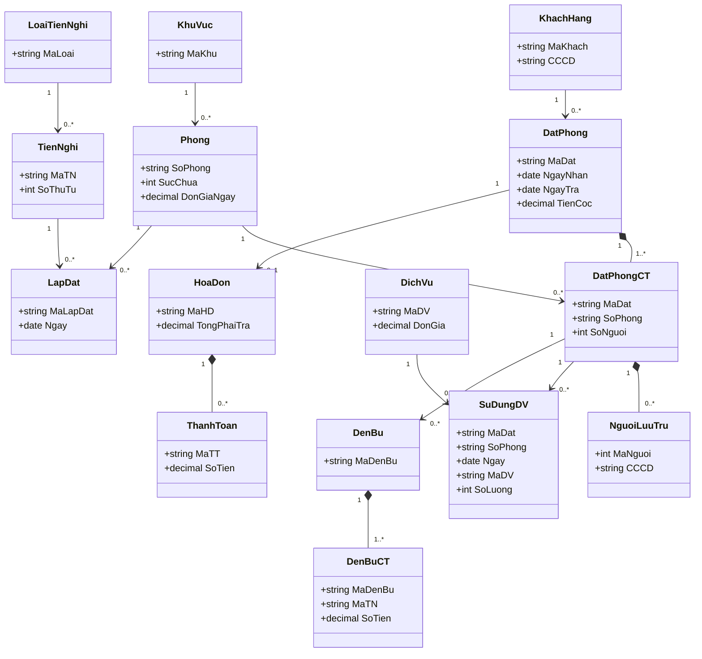

## Trạng thái phiếu đặt và hóa đơn

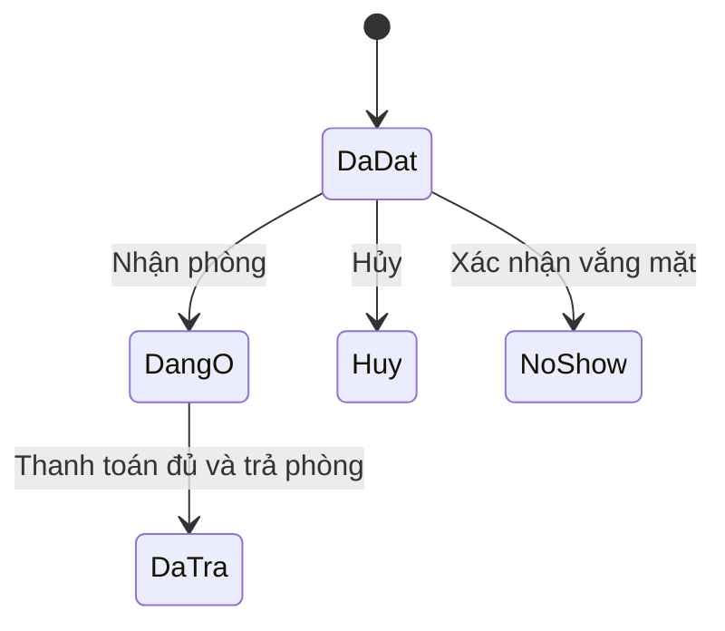

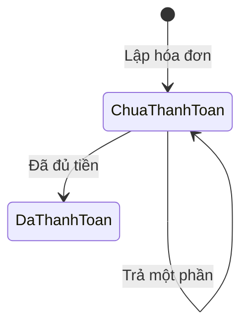

## Tuần tự nghiệp vụ

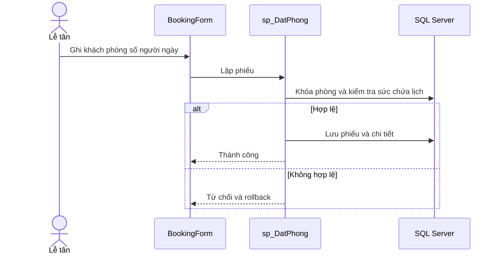

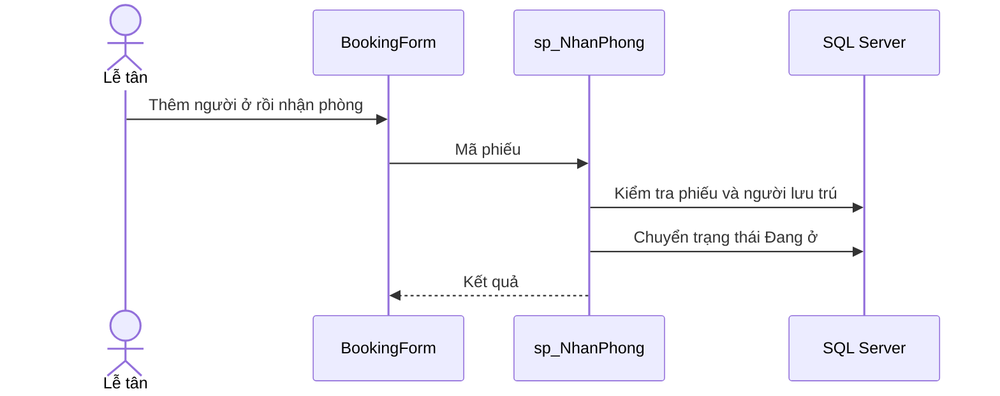

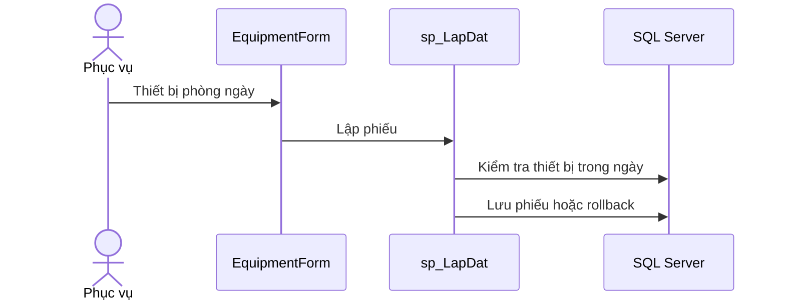

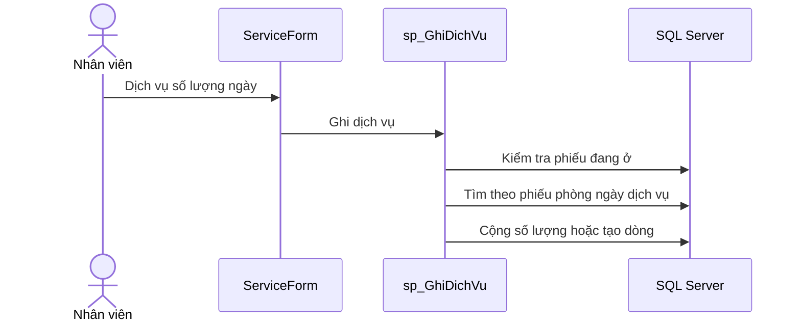

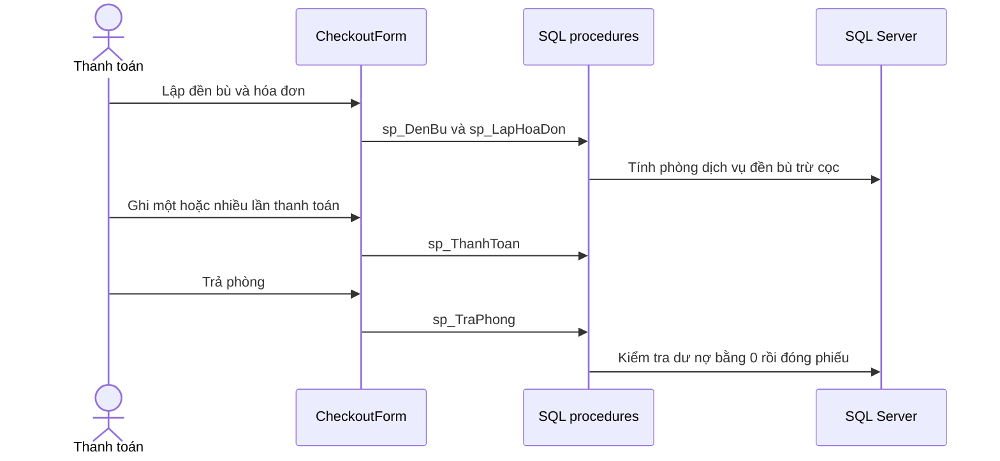

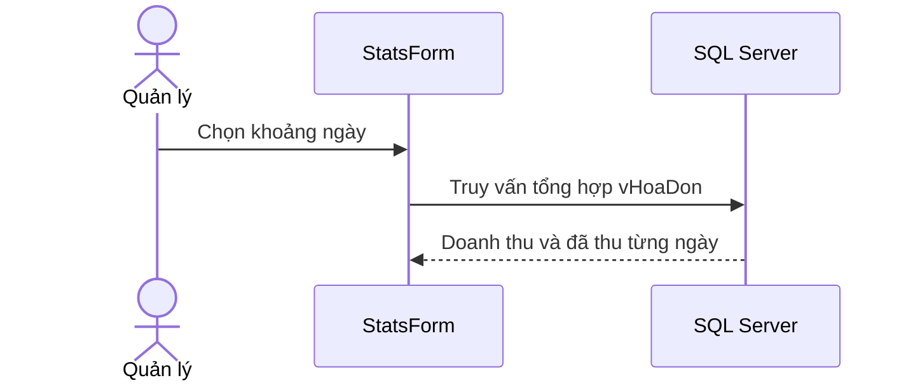

## Lớp chi tiết module

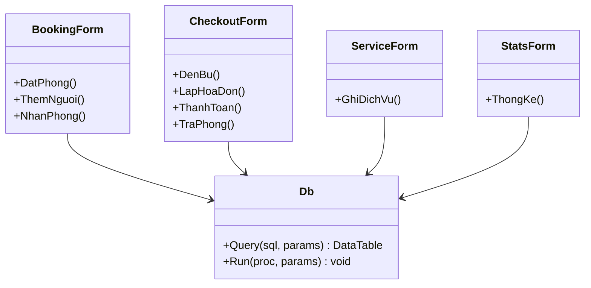

## Hoạt động đặt phòng

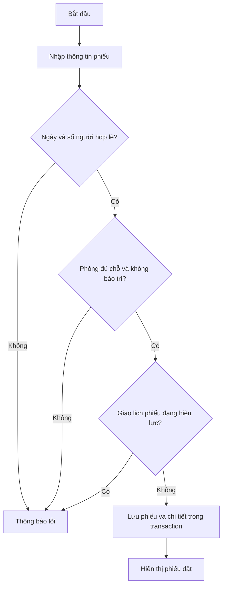
